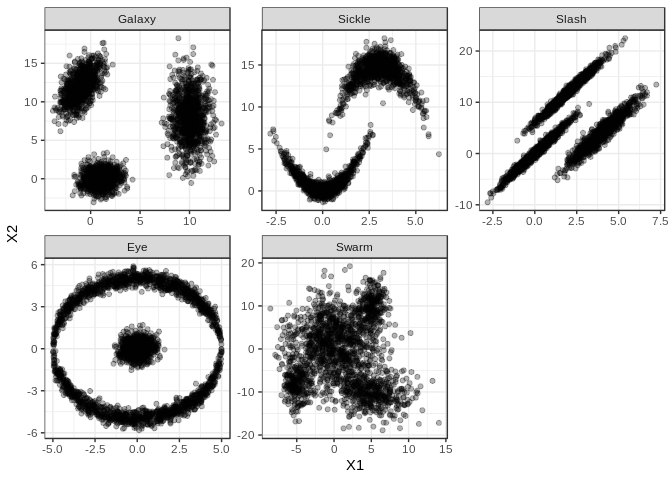
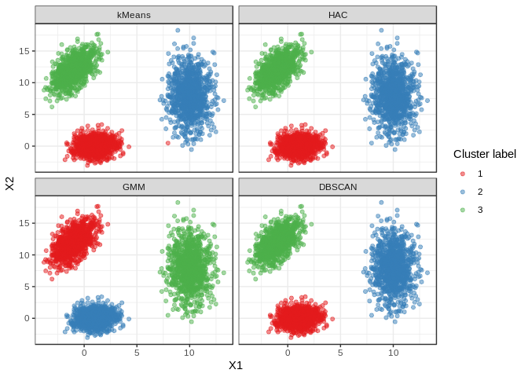
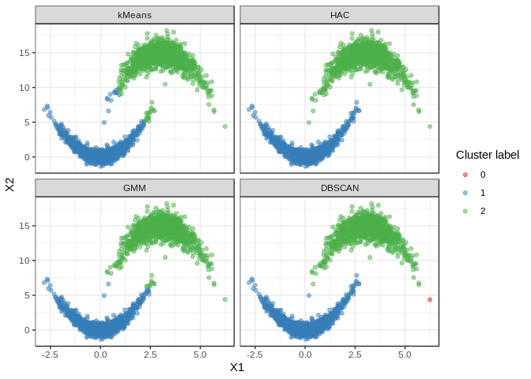
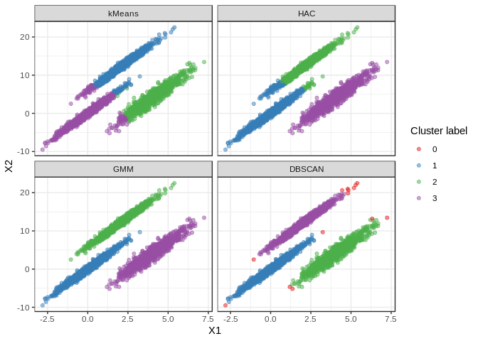
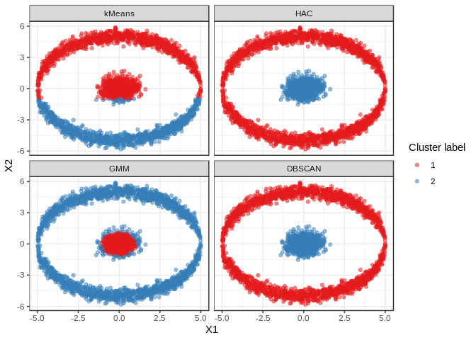
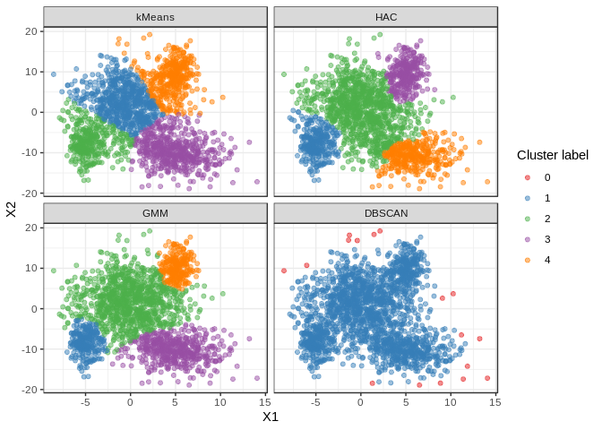
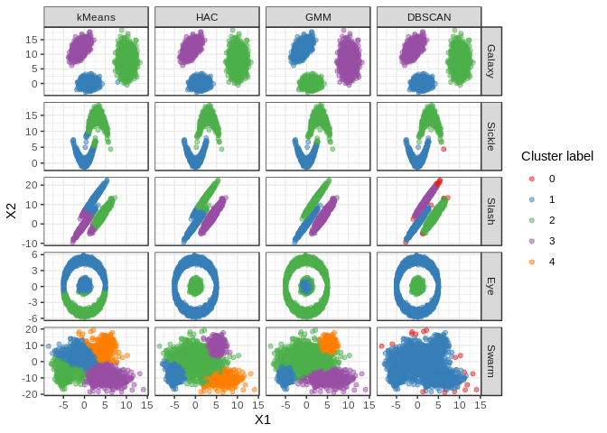

A comparison of four Clustering algorithms
================
Gabriel Mello Silva
November 15, 2018

Introduction
------------

This kernel is a comparison between four different unsupervised learning clustering algorithms over simulated data. Four algorithms are tested:

-   k-Means;
-   Hierarchical Agglomerative Clustering (HAC);
-   Expectation–Maximization clustering using Gaussian Mixture Models (GMM); and
-   Density-Based Spatial Clustering of Applications with Noise (DBSCAN)

I generated five datasets from normal and uniform distribuitions to simulate practical cases. Each dataset presents a different pattern and challenge for the algorithm.

It is not my intent to cover each algorithm in details, but I tried to tweak some of the parameters to avoid underperformance due to bad usage. Clustering is highly dependent on the particular dataset and the analysis objective. However, it is interesting to see how each algorithm performs on each case to give an idea of when to use a particular algorithm.

------------------------------------------------------------------------

``` r
library(dplyr)    # Data manipulation
library(tidyr)    # Data manipulation
library(ggplot2)  # Data visualization

library(mclust)   # Package for GMM clustering
library(fpc)      # Package for DBSCAN clustering
```

Data generation
---------------

Let's start by generating some pseudo-random data. The distribuitions are used to shape and add some noise to each dataset.

``` r
set.seed(123)

# Normal distribuition
A1 <- rnorm(1000, mean = 0, sd = 1)
B1 <- rnorm(1000, mean = 0, sd = 1)

A3 <- rnorm(1000, mean = 0, sd = 3)
B3 <- rnorm(1000, mean = 0, sd = 3)

A5 <- rnorm(1000, mean = 0, sd = 5)

# Uniform distribuition
U2 <- runif(1000, min = -2, max = 2)
U5 <- runif(1000, min = -5, max = 5)
```

Each dataset has two features *X1* and *X2*, which generate the clusters' points from the distribuitions above, and a *dataset* label (for data visualization purposes). The names were simply inspired in the shape of the data and are by no means technical names.

The vector spacing in the code below is unusual, but I found it easier to relate X1 and X2 this way.

``` r
# GALAXY: three well separated clusters
galaxy <- data.frame(X1 = c(A1 + 1, A1 + 10, A1 - 1        ),
                     X2 = c(B1    , A3 + 8 , A1 + A3/2 + 12),
                     dataset = rep("Galaxy", 3000))

# SICKLE: two 'almost-intersecting' parabolas
sickle <- data.frame(X1 = c(A1         ,  A1 + 3        ),
                     X2 = c(A1^2 + B1/2, -A1^2 + B1 + 15),
                    dataset = rep("Sickle", 2000))

# SLASH: three long-shaped clusters
slash <- data.frame(X1 = c(A1         , A1 + 4         , B1 + 2          ),
                    X2 = c(3*A1 + B1/2, 3*A1 + A3/3 + 4, 3*B1 + A1/2 + 12),
                   dataset = rep("Slash", 3000))

# EYE: two concentric circular clusters
eye <- data.frame(X1 = c(U5                    , U5                     , A1/2),
                  X2 = c(sqrt(25 - U5^2) + A1/3, -sqrt(25 - U5^2) + B1/3, B1/2),
                  dataset = rep("Eye", 3000))

# SWARM: four colliding clusters with no clear boundaries
swarm <- data.frame(X1 = c(A1[1:250] - 5, A3    ,  A3[1:500] + 5               , A1[251:500] + 5),
                    X2 = c(B3[1:250] - 8, A5 + 2, -A3[1:500]/4 + B3[1:500] - 10, B3[251:500] + 10),
                    dataset = rep("Swarm", 2000))


# Bind all datasets into one dataframe
data <- bind_rows(galaxy, sickle, slash, eye, swarm)
data$dataset <- factor(data$dataset, levels = c("Galaxy", "Sickle", "Slash", "Eye", "Swarm"))

# Create new columns for each clustering
data <- mutate(data, kMeans = NA, HAC = NA, GMM = NA, DBSCAN = NA)
```

``` r
# Visualize each dataset
ggplot(data, aes(x = X1, y = X2)) +
  geom_point(alpha = 0.3) +
  facet_wrap(. ~ dataset, scales = "free") +
  theme_bw()
```



### Two useful functions

The function *calc\_cluster* takes the dataset (as a subset of the *data* dataframe) and parameters for each algorithm as arguments and calculates the clusters and add the corresponding labels into the dataframe.

The function *plot\_cluster* takes the dataset name as an argument and plots the clusters calculated by each algorithm.

``` r
# Calculate clusters
calc_cluster <- function(ds, kmeans.centers, hac.method, hac.k, gmm.G, dbscan.eps) {
  # Scale the data
  ds.scaled <- data.frame(scale(ds[, c("X1", "X2")]))
  
  # k-Means
  ds$kMeans <- kmeans(ds.scaled[, c("X1", "X2")], centers = kmeans.centers, nstart = 5)$cluster
  
  # Hierarchical Agglomerative Clustering (HAC)
  distance <- dist(ds.scaled[, c("X1", "X2")], method = "euclidean")
  ds$HAC <- hclust(distance, method = hac.method) %>% cutree(k = hac.k)
  
  # Gaussian Mixture Model (GMM)
  ds$GMM <- Mclust(ds.scaled[, c("X1", "X2")], G = gmm.G)$classification
  
  # DBSCAN
  ds$DBSCAN <- dbscan(ds.scaled[, c("X1", "X2")], eps = dbscan.eps, MinPts = 20)$cluster
  
  return(ds)
}


# Plot clusters
plot_cluster <- function(ds.name) {
  data %>%
  filter(dataset == ds.name) %>%
  gather(-X1, -X2, -dataset, key = "clustering.method", value = "cluster") %>%
  ggplot(aes(x = X1, y = X2, color = factor(cluster))) + 
    geom_point(alpha = .5) +
    facet_wrap(. ~ factor(clustering.method, levels = c("kMeans", "HAC", "GMM","DBSCAN"))) +
    scale_color_brewer(palette = "Set1") +
    theme_bw() +
    guides(color=guide_legend(title="Cluster label"))
}
```

Dataset clustering
------------------

Now it is time to see how the algorithms perform. For each dataset, the parameters of the algorithm are changed in order to avoid a false underperfomance impression. Of course, there are more parameters and options and in a real problem you should ajust them accordingly.

Note: DBSCAN sometimes outputs a 'zero' label cluster. This represents an outlier detected by the algorithm.

### Galaxy

``` r
data[data$dataset == "Galaxy", ] <- calc_cluster(data[data$dataset == "Galaxy", ], 
                                                 kmeans.centers = 3, 
                                                 hac.method = "average", hac.k = 3, 
                                                 gmm.G = 3, dbscan.eps = .5)
plot_cluster("Galaxy")
```



The simplest dataset. No problems here (except for a intruder point in one of the clusters given by k-Means).

### Sickle

``` r
data[data$dataset == "Sickle", ] <- calc_cluster(data[data$dataset == "Sickle", ], 
                                                 kmeans.centers = 2,
                                                 hac.method = "ward.D", hac.k = 2, 
                                                 gmm.G = 2, dbscan.eps = .5)
plot_cluster("Sickle")
```



It's getting trickier. There is some misclassification by k-Means and GMM where the "edges" are close.

### Slash

``` r
data[data$dataset == "Slash", ] <- calc_cluster(data[data$dataset == "Slash", ], 
                                                kmeans.centers = 3,
                                                hac.method = "average", hac.k = 3, 
                                                gmm.G = 3, dbscan.eps = .3)
plot_cluster("Slash")
```



k-Means and HAC have a difficult time in clustering this dataset due to its long-shaped clusters. On the other hand, GMM and DBSCAN algorithms can ajust better to the particular shapes of clusters.

### Eye

``` r
data[data$dataset == "Eye", ] <- calc_cluster(data[data$dataset == "Eye", ], 
                                              kmeans.centers = 2,
                                              hac.method = "single", hac.k = 2, 
                                              gmm.G = 2, dbscan.eps = .3)
plot_cluster("Eye")
```



HAC and DBSCAN seem to be better adapted to this dataset's very unusual clusters. Its interesting how GMM separates the core and the noise of the inner circle.

One could argue that there are 3 clusters: top and bottom outer circunference, and inner circle, but the general results don't change too much for this case.

### Swarm

``` r
data[data$dataset == "Swarm", ] <- calc_cluster(data[data$dataset == "Swarm", ], 
                                                kmeans.centers = 4,
                                                hac.method = "ward.D", hac.k = 4, 
                                                gmm.G = 4, dbscan.eps = .4)
plot_cluster("Swarm")
```



For this dataset, there are no clear boundaries between clusters. This is where we have a hard time using DBSCAN, because it seems we just can't choose parameters to separate the data in a reasonable number of clusters (3 to 6 in this case). For instance, if the *epsilon* value is lowered to define a smaller neighborhood, suddenly we get more than 15 clusters.

All versus All: Conclusion
--------------------------

k-Means is an intuitive, fast algorithm but it fails to handle cases in which the clusters are not well separated or overlap because the cluster's center is defined by the mean value of its points.

For more complex cases, other algorithms can do a better job at identifying non-obvious clusters. For a higher cost. For larger datasets, with hundreds of thousands of observations or dozens of features, computation time is a decisive factor. That is why it is essential to know the advantages and disadvantages of each algorithm.

``` r
data %>%
  gather(-X1, -X2, -dataset, key = "clustering.method", value = "cluster") %>%
  ggplot(aes(x = X1, y = X2, color = factor(cluster))) + 
    geom_point(alpha = .5) +
    facet_grid(dataset ~ factor(clustering.method, levels = c("kMeans", "HAC", "GMM", "DBSCAN")), 
               scales = "free") +
    scale_color_brewer(palette = "Set1") +
    theme_bw() +
    guides(color=guide_legend(title="Cluster label"))
```



------------------------------------------------------------------------

I hope this comparison can help new students of Machine Learning to get a grasp of some other clustering algorithms as it helped me. Any suggestions are appreciated!
